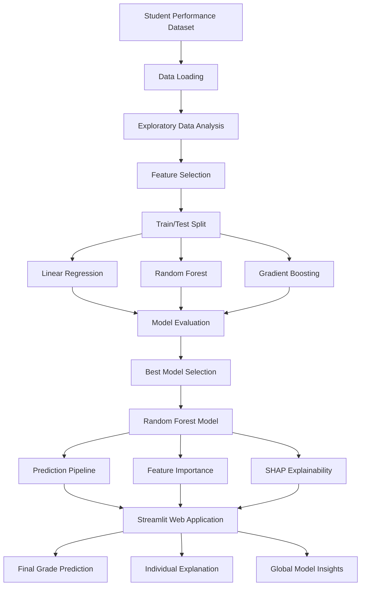

# 🎓 Student Performance Analyzer

**End-to-end machine learning application for predicting student final grades with model evaluation, feature importance, and Explainable AI using SHAP.**

[](https://www.python.org/)
[](https://scikit-learn.org/)
[](https://streamlit.io/)
[](https://shap.readthedocs.io/)
[](https://github.com/harshatripathi7/student-performance-analyzer)

**Live Demo:** [Student Performance Analyzer](https://student-performance-analyzer-iidybamk2j9q2x2ddzmuvu.streamlit.app/)

---

## 📌 Overview

Student Performance Analyzer is an end-to-end machine learning project that predicts a student's final academic grade (`G3`) using demographic, academic, and lifestyle-related features.

The project goes beyond model training by implementing:

* Exploratory Data Analysis
* Data visualization
* Multiple regression models
* Model performance comparison
* Random Forest model selection
* Model evaluation
* Feature importance analysis
* SHAP-based Explainable AI
* Interactive Streamlit deployment
* Reproducible project structure
* Git-based version control

The application achieves an **R² score of 0.85** with a Random Forest Regressor on the held-out test set, with an **MAE of 1.08** and **RMSE of 1.78**.

---

# 🏗️ System Architecture

The project follows a modular machine-learning pipeline:



### Pipeline

**Data → EDA → Feature Engineering/Selection → Model Training → Model Comparison → Best Model → Evaluation → Explainability → Deployment**

This separation makes the project easier to maintain, test, and extend.

---

# 🚀 Key Features

## 1. Exploratory Data Analysis

The dataset is analyzed to identify relationships between student characteristics and academic performance.

Current visualizations include:

* Final grade distribution
* Study time vs final grade
* Previous failures vs final grade
* Actual vs predicted grades
* Residual plot
* Prediction error distribution
* Feature importance

---

## 2. Multiple Model Training

Three regression algorithms are evaluated:

* Linear Regression
* Random Forest Regressor
* Gradient Boosting Regressor

### Model Comparison

| Model             |      MAE |     RMSE |       R² |
| ----------------- | -------: | -------: | -------: |
| Linear Regression |     1.38 |     2.16 |     0.77 |
| Random Forest     | **1.08** | **1.78** | **0.85** |
| Gradient Boosting |     1.16 |     1.85 |     0.83 |

Random Forest was selected as the final model because it achieved the best performance across the evaluation metrics.

---

## 3. Model Evaluation

The final Random Forest model achieves:

| Metric |    Score |
| ------ | -------: |
| MAE    | **1.08** |
| RMSE   | **1.78** |
| R²     | **0.85** |

### Interpretation

An **R² score of 0.85** means the model explains approximately 85% of the variance in final grades within the test set.

An **MAE of 1.08** means that predictions are, on average, approximately 1.08 grade points away from the actual final grade.

---

# 🧠 Explainable AI with SHAP

The project incorporates **SHAP (SHapley Additive exPlanations)** to make the Random Forest model interpretable.

Instead of only producing:

> Predicted Final Grade: 13.2 / 20

the application can also explain **why the model produced that prediction**.

### SHAP analysis includes:

* Global feature importance
* SHAP summary plot
* Individual prediction explanations
* SHAP waterfall visualization
* Feature contribution values

### Key Finding

The current SHAP analysis shows that **G2 (second-period grade)** is the dominant predictive feature, followed by **absences**.

This is expected because G2 is an academic performance measure immediately preceding the final grade G3.

The analysis also demonstrates an important machine-learning consideration: highly predictive variables can provide excellent predictive performance while potentially limiting the usefulness of the model for **early intervention**, because G2 may only become available relatively late in the academic period.

---

# 📊 Feature Importance

Random Forest feature importance analysis currently identifies the following features as the strongest contributors:

| Feature            | Importance |
| ------------------ | ---------: |
| G2                 |      0.791 |
| Absences           |      0.116 |
| Age                |      0.027 |
| Health             |      0.017 |
| Father's Education |      0.012 |
| G1                 |      0.010 |
| Going Out          |      0.008 |
| Study Time         |      0.006 |
| Free Time          |      0.006 |
| Mother's Education |      0.005 |
| Previous Failures  |      0.004 |

SHAP is used alongside built-in Random Forest feature importance to provide a more interpretable view of model behavior.

---

# 📊 Dataset

The project uses the **Student Performance Dataset**, containing information about student demographics, academic performance, family background, study habits, lifestyle, and school attendance.

### Dataset characteristics

* **395 students**
* **33 features**
* Target variable: `G3`
* Final grade range: **0–20**

### Selected Features

| Feature     | Description                       |
| ----------- | --------------------------------- |
| `age`       | Student age                       |
| `studytime` | Weekly study time                 |
| `failures`  | Number of previous class failures |
| `absences`  | Number of school absences         |
| `G1`        | First-period grade                |
| `G2`        | Second-period grade               |
| `Medu`      | Mother's education level          |
| `Fedu`      | Father's education level          |
| `freetime`  | Free time after school            |
| `goout`     | Frequency of going out            |
| `health`    | Current health status             |

### Target

```text
G3 — Final Grade
```

---

# 🌐 Interactive Web Application

The Streamlit application allows users to enter student information and receive:

1. Predicted final grade
2. Model prediction details
3. Individual feature contributions
4. SHAP-based explanation
5. Global model insights

### Live Demo

**[Launch Student Performance Analyzer](https://student-performance-analyzer-iidybamk2j9q2x2ddzmuvu.streamlit.app/)**

---

# 🛠️ Technology Stack

### Programming

* Python 3.13

### Data Science

* Pandas
* NumPy
* Matplotlib
* Seaborn

### Machine Learning

* Scikit-learn
* Linear Regression
* Random Forest
* Gradient Boosting

### Explainable AI

* SHAP

### Model Persistence

* Joblib

### Application

* Streamlit

### Development

* Git
* GitHub
* Virtual environments

---

# 📁 Project Structure

```text
student-performance-analyzer/
│
├── app/
│   └── app.py
│
├── data/
│   └── raw/
│       ├── student-mat.csv
│       └── student.txt
│
├── models/
│   └── student_performance_model.pkl
│
├── reports/
│   └── figures/
│       ├── actual_vs_predicted.png
│       ├── error_distribution.png
│       ├── failures_vs_grade.png
│       ├── feature_importance.png
│       ├── final_grade_distribution.png
│       ├── residual_plot.png
│       ├── shap_feature_importance.png
│       ├── shap_summary.png
│       ├── shap_waterfall.png
│       └── studytime_vs_grade.png
│
├── src/
│   ├── data_loader.py
│   ├── eda.py
│   ├── evaluate_model.py
│   ├── feature_importance.py
│   ├── predict.py
│   ├── shap_explanation.py
│   ├── train_model.py
│   └── visualization.py
│
├── .gitignore
├── README.md
├── requirements.txt
└── LICENSE
```

---

# ⚙️ Installation

Clone the repository:

```bash
git clone https://github.com/harshatripathi7/student-performance-analyzer.git
```

Navigate into the project:

```bash
cd student-performance-analyzer
```

Create a virtual environment:

```bash
python3 -m venv .venv
```

Activate it:

### macOS / Linux

```bash
source .venv/bin/activate
```

### Windows

```bash
.venv\Scripts\activate
```

Install dependencies:

```bash
pip install -r requirements.txt
```

---

# ▶️ Running the Project

### Run exploratory analysis

```bash
python3 src/eda.py
```

### Generate visualizations

```bash
python3 src/visualization.py
```

### Train and compare models

```bash
python3 src/train_model.py
```

### Evaluate the final model

```bash
python3 src/evaluate_model.py
```

### Generate feature importance

```bash
python3 src/feature_importance.py
```

### Generate SHAP explanations

```bash
python3 src/shap_explanation.py
```

### Make a terminal prediction

```bash
python3 src/predict.py
```

### Launch the Streamlit application

```bash
streamlit run app/app.py
```

The application will normally be available at:

```text
http://localhost:8501
```

---

# 🔬 Machine Learning Workflow

The project follows a reproducible workflow:

### 1. Load Data

The Student Performance dataset is loaded using Pandas.

### 2. Select Features

Relevant academic, demographic, and lifestyle features are selected.

### 3. Split Dataset

The dataset is divided into:

* 80% training data
* 20% testing data

using a fixed random state for reproducibility.

### 4. Train Multiple Models

Three regression models are trained and evaluated.

### 5. Compare Models

MAE, RMSE, and R² are used to compare performance.

### 6. Select Best Model

Random Forest achieves the highest R² and lowest error.

### 7. Persist Model

The trained model is serialized using Joblib.

### 8. Evaluate Predictions

Actual and predicted values are analyzed using regression metrics and diagnostic plots.

### 9. Explain Predictions

SHAP provides both global and individual prediction explanations.

### 10. Deploy

The model is exposed through an interactive Streamlit application.

---

# 🧪 Model Evaluation

Evaluation includes:

* Mean Absolute Error
* Root Mean Squared Error
* R² Score
* Actual vs predicted plot
* Residual plot
* Error distribution

These diagnostics provide a more complete evaluation than relying on a single performance metric.

---

# 🔮 Future Improvements

Planned improvements include:

* Hyperparameter optimization
* Cross-validation
* Automated unit tests
* Model monitoring
* Improved error analysis
* Additional ML algorithms
* Prediction confidence intervals
* More interactive SHAP visualizations
* Automated CI/CD using GitHub Actions
* Improved UI/UX
* Containerized deployment
* Early-warning prediction using only features available before final examinations

---

# 💼 Why This Project Is Portfolio-Relevant

This project demonstrates practical skills across the complete machine-learning development lifecycle:

**Data → Analysis → Modeling → Evaluation → Explainability → Application → Deployment**

Technical competencies demonstrated include:

* Python development
* Data preprocessing
* Exploratory data analysis
* Regression modeling
* Ensemble learning
* Model comparison
* Model evaluation
* Feature importance
* Explainable AI
* SHAP
* Model serialization
* Streamlit application development
* Git/GitHub
* Cloud deployment

Rather than treating machine learning as a notebook-only exercise, the project packages the trained model into a usable application and provides explanations for its predictions.

---

# 👩‍💻 Author

## Harsha Tripathi

**B.Tech Computer Science & Engineering**

Interested in:

* Machine Learning
* Artificial Intelligence
* Explainable AI
* Data Science
* Software Development
* Research

### Links

* **GitHub:** [harshatripathi7](https://github.com/harshatripathi7)
* **Project Repository:** [Student Performance Analyzer](https://github.com/harshatripathi7/student-performance-analyzer)
* **Live Application:** [Streamlit Demo](https://student-performance-analyzer-iidybamk2j9q2x2ddzmuvu.streamlit.app/)

---

# ⭐ Project Status

**Active development**

The project is currently functional and deployed. Future development will focus on automated testing, model optimization, improved explainability, and production-oriented machine-learning practices.

